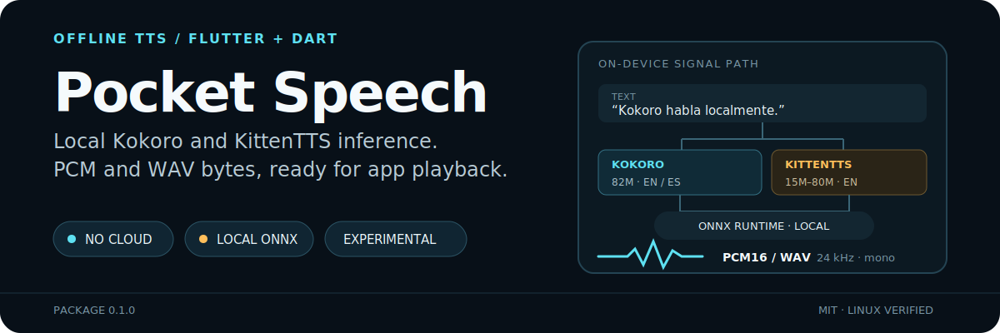
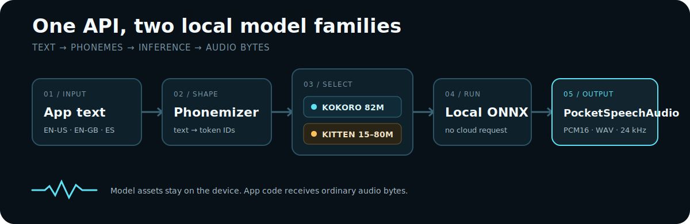

<p align="center">
  
</p>

<p align="center">
  <a href="https://github.com/TrebuchetDynamics/pocket-speech-dart/actions/workflows/ci.yml"></a>
  
  
  <a href="./LICENSE"></a>
</p>

Pocket Speech is an experimental Flutter/Dart library for running **Kokoro** and **KittenTTS** model packs through ONNX Runtime. Synthesis stays on-device after model setup; your app receives ordinary PCM samples or WAV bytes.

> [!IMPORTANT]
> The package is not published to pub.dev yet (`publish_to: none`). Linux desktop is verified; Android and iOS are not yet verified.

## Proof before promise

The repository includes a real, opt-in Linux test that runs this loop twice in both English and Spanish:

```text
seed text → Kokoro TTS → local Whisper STT → Kokoro TTS → local Whisper STT
```

Each transcript must retain at least `0.72` similarity to the seed. The checked-in test has passed on Linux without a cloud speech API.

| Capability | Current evidence |
| --- | --- |
| Local inference | Kokoro and KittenTTS run through `flutter_onnxruntime` |
| Audio output | 24 kHz mono `PocketSpeechAudio`, PCM16, and WAV |
| Languages | American/British English and approximate Spanish phonemization |
| Linux | Real recursive EN/ES TTS→STT test passed |
| Android / iOS | Unverified |

## Pick a model

| Model family | ONNX file | Language | Good fit |
| --- | ---: | --- | --- |
| KittenTTS nano-int8 | ~24 MB | English | Smallest pack; upstream warns it may have issues |
| KittenTTS micro | ~41 MB | English | Compact default alternative |
| KittenTTS nano-fp32 | ~57 MB | English | Recommended nano variant |
| KittenTTS mini | ~78 MB | English | Largest KittenTTS pack |
| Kokoro | ~326 MB | English / Spanish | Larger optional voice pack |

Each model also needs its voice data. The download tools create the complete selected pack.

## Quick start with KittenTTS

### 1. Add the package

Until the package is published, use a path dependency:

```yaml
dependencies:
  pocket_speech:
    path: ../pocket-speech-dart
```

### 2. Download a model pack

From the Pocket Speech checkout:

```bash
python3 -m pip install numpy
python3 tool/download_kitten_assets.py \
  --out assets/kitten \
  --models nano-fp32
```

Add the selected files to your app:

```yaml
flutter:
  assets:
    - assets/kitten/nano-fp32/model.onnx
    - assets/kitten/nano-fp32/voices.json
```

### 3. Synthesize WAV bytes

```dart
import 'package:pocket_speech/pocket_speech.dart';

final tts = PocketSpeech.kitten(
  const KittenTtsConfig(
    modelAsset: 'assets/kitten/nano-fp32/model.onnx',
    voicesAsset: 'assets/kitten/nano-fp32/voices.json',
    model: KittenTtsModel.nanoFp32,
  ),
);

final wavBytes = await tts.synthesizeWav(
  'Kitten TTS is running locally.',
  voice: 'Jasper',
);

await tts.dispose();
```

KittenTTS exposes eight friendly voice aliases through `KittenCatalog.voices` and all downloadable variants through `KittenCatalog.models`.

## How synthesis stays local

<p align="center">
  
</p>

`PocketSpeech.kokoro(...)` and `PocketSpeech.kitten(...)` create explicit provider implementations. Both return the same provider-neutral `PocketSpeechAudio` result, so playback code does not need to know which model produced it.

## Use Kokoro

Kokoro is the larger option. Download its ONNX model and export only the voices your app needs:

```bash
python3 -m pip install numpy
python3 tool/download_kokoro_assets.py \
  --out assets/kokoro \
  --voices af_heart,ef_dora
```

The command writes:

```text
assets/kokoro/kokoro-v1.0.onnx   # ~326 MB
assets/kokoro/voices-v1.0.bin    # ~28 MB, full upstream voice data
assets/kokoro/voices.json        # selected Flutter-readable voices
```

It also prints exact byte sizes and SHA-256 hashes. Do not commit these large files unless your app intentionally vendors them. Register only the runtime files in your app:

```yaml
flutter:
  assets:
    - assets/kokoro/kokoro-v1.0.onnx
    - assets/kokoro/voices.json
```

```dart
final tts = PocketSpeech.kokoro(
  const KokoroTtsConfig(
    modelAsset: 'assets/kokoro/kokoro-v1.0.onnx',
    voicesAsset: 'assets/kokoro/voices.json',
  ),
);

final wavBytes = await tts.synthesizeWav(
  'Kokoro habla localmente.',
  voice: 'ef_dora',
  language: 'es',
  speed: 1.15,
);
```

### Catalog and synthesis options

```dart
final languages = KokoroCatalog.languages;
final spanishVoices = KokoroCatalog.voicesForLanguage('es');
final speed = KokoroCatalog.speed; // min 0.5, default 1.0, max 2.0

final options = KokoroSynthesisOptions.forLanguage('es').copyWith(
  voice: 'ef_dora',
  speed: 1.15,
);

final wavBytes = await tts.synthesizeWavWithOptions(
  'Kokoro habla localmente.',
  options,
);
```

The built-in phonemizer supports American/British English and approximate Spanish. Other upstream Kokoro languages need a compatible phonemizer before Pocket Speech can expose them correctly.

<details>
<summary><strong>Mobile asset delivery guidance</strong></summary>

Do not put a ~326 MB Kokoro model in the base APK/AAB unless offline-on-first-launch matters more than install size.

- **Offline-first:** use Play Asset Delivery install-time or fast-follow packs.
- **Smaller initial install:** use on-demand packs and block TTS until assets arrive.
- **Custom distribution:** download on first run with resume, SHA-256 verification, and a clear Wi-Fi/storage prompt.

If assets arrive after install, the app is not fully offline until that download or asset-pack installation completes.

</details>

## Run the real recursive test

The live test is opt-in because it requires the large Kokoro files and a local STT command. It does not call a cloud API.

```bash
python3 -m pip install numpy openai-whisper
python3 tool/setup_e2e_assets.py

flutter test integration_test/recursive_tts_stt_e2e_test.dart -d linux \
  --dart-define=POCKET_SPEECH_E2E=true \
  --dart-define=POCKET_SPEECH_STT_COMMAND='["python3","-m","whisper","{wav}","--language","{lang}","--model","tiny","--device","cpu","--fp16","False","--output_format","txt","--output_dir","{dir}"]'
```

`POCKET_SPEECH_STT_COMMAND` is a JSON string array with these placeholders:

- `{wav}` — generated WAV path
- `{lang}` — `en` or `es`
- `{dir}` — temporary output directory

Optional overrides: `POCKET_SPEECH_MODEL_ASSET`, `POCKET_SPEECH_VOICES_ASSET`, `POCKET_SPEECH_EN_VOICE`, and `POCKET_SPEECH_ES_VOICE`.

## Project boundaries

- Inference is local, but the setup tools download model files.
- Model files are not committed or redistributed by this repository.
- Upstream [Kokoro-82M](https://github.com/hexgrad/kokoro) is an Apache-licensed, 82M-parameter open-weight model.
- Kokoro and KittenTTS remain explicit model families rather than hidden provider abstractions.
- See [Third-party notices](./THIRD_PARTY_NOTICES.md) for upstream licensing and provenance.
- Security reports belong in [GitHub Security Advisories](https://github.com/TrebuchetDynamics/pocket-speech-dart/security/advisories/new); never include private audio, model files, or credentials in public issues.

## Contributing

Start with [CONTRIBUTING.md](./CONTRIBUTING.md), then run:

```bash
flutter pub get
flutter analyze
flutter test
python3 -m unittest discover -s test -p '*_python_test.py'
```

Pocket Speech is available under the [MIT License](./LICENSE).
